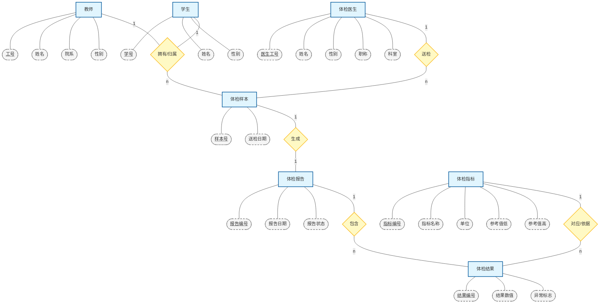

```mermaid
graph TD
    %% --- 样式定义 (让图形更清晰) ---
    classDef entity fill:#e1f5fe,stroke:#01579b,stroke-width:2px;
    classDef relation fill:#fff9c4,stroke:#fbc02d,stroke-width:2px,shape:diamond;
    classDef attr fill:#f5f5f5,stroke:#616161,stroke-dasharray: 5 5;

    %% --- 实体 (Entity) ---
    Teacher[教师]:::entity
    Student[学生]:::entity
    Doctor[体检医生]:::entity
    Sample[体检样本]:::entity
    Report[体检报告]:::entity
    Result[体检结果]:::entity
    Indicator[体检指标]:::entity

    %% --- 关系 (Relationship) ---
    Rel_Own{拥有/归属}:::relation
    Rel_Send{送检}:::relation
    Rel_Gen{生成}:::relation
    Rel_Inc{包含}:::relation
    Rel_Ref{对应/依据}:::relation

    %% --- 属性 (Attribute) ---
    %% 教师属性
    T_ID([<u>工号</u>]):::attr
    T_Name([姓名]):::attr
    T_Dept([院系]):::attr
    T_Sex([性别]):::attr
    Teacher --- T_ID & T_Name & T_Dept & T_Sex

    %% 学生属性
    S_ID([<u>学号</u>]):::attr
    S_Name([姓名]):::attr
    S_Sex([性别]):::attr
    Student --- S_ID & S_Name & S_Sex

    %% 医生属性
    D_ID([<u>医生工号</u>]):::attr
    D_Name([姓名]):::attr
    D_Sex([性别]):::attr
    D_Title([职称]):::attr
    D_Dept([科室]):::attr
    Doctor --- D_ID & D_Name & D_Sex & D_Title & D_Dept

    %% 样本属性
    Sam_ID([<u>样本号</u>]):::attr
    Sam_Date([送检日期]):::attr
    Sample --- Sam_ID & Sam_Date

    %% 报告属性
    Rep_ID([<u>报告编号</u>]):::attr
    Rep_Date([报告日期]):::attr
    Rep_Status([报告状态]):::attr
    Report --- Rep_ID & Rep_Date & Rep_Status

    %% 结果属性
    Res_ID([<u>结果编号</u>]):::attr
    Res_Val([结果数值]):::attr
    Res_Abn([异常标志]):::attr
    Result --- Res_ID & Res_Val & Res_Abn

    %% 指标属性
    Ind_ID([<u>指标编号</u>]):::attr
    Ind_Name([指标名称]):::attr
    Ind_Unit([单位]):::attr
    Ind_Low([参考值低]):::attr
    Ind_High([参考值高]):::attr
    Indicator --- Ind_ID & Ind_Name & Ind_Unit & Ind_Low & Ind_High

    %% --- 连线与基数 (Relationships) ---
    
    %% 教师/学生 -> 样本
    Teacher ---|1| Rel_Own
    Student ---|1| Rel_Own
    Rel_Own ---|n| Sample

    %% 医生 -> 样本
    Doctor ---|1| Rel_Send
    Rel_Send ---|n| Sample

    %% 样本 -> 报告
    Sample ---|1| Rel_Gen
    Rel_Gen ---|1| Report

    %% 报告 -> 结果
    Report ---|1| Rel_Inc
    Rel_Inc ---|n| Result

    %% 指标 -> 结果
    Indicator ---|1| Rel_Ref
    Rel_Ref ---|n| Result
```