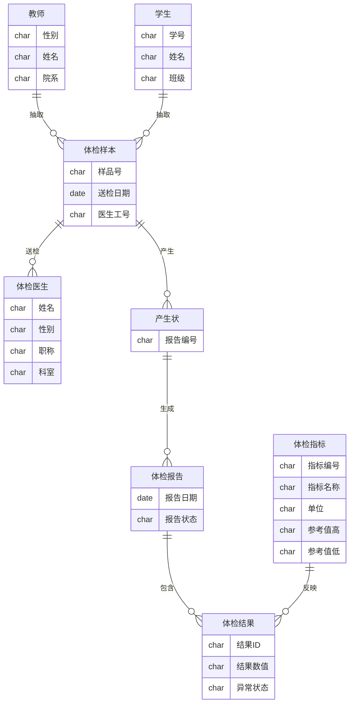

```mermaid
erDiagram
    教师 {
        char 性别
        char 姓名
        char 院系
    }
    学生 {
        char 学号
        char 姓名
        char 班级
    }
    体检样本 {
        char 样品号
        date 送检日期
        char 医生工号
    }
    体检医生 {
        char 姓名
        char 性别
        char 职称
        char 科室
    }
    产生状 {
        char 报告编号
    }
    体检报告 {
        date 报告日期
        char 报告状态
    }
    体检指标 {
        char 指标编号
        char 指标名称
        char 单位
        char 参考值高
        char 参考值低
    }
    体检结果 {
        char 结果ID
        char 结果数值
        char 异常状态
    }

    教师 ||--o{ 体检样本 : 抽取
    学生 ||--o{ 体检样本 : 抽取
    体检样本 ||--o{ 体检医生 : 送检
    体检样本 ||--o{ 产生状 : 产生
    产生状 ||--o{ 体检报告 : 生成
    体检报告 ||--o{ 体检结果 : 包含
    体检指标 ||--o{ 体检结果 : 反映

```